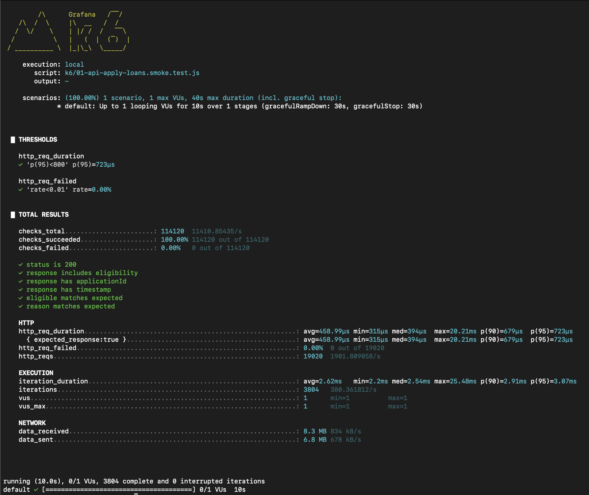
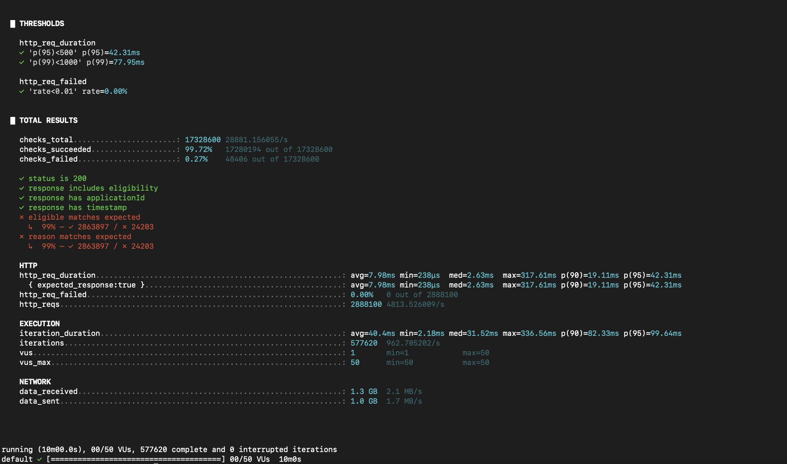
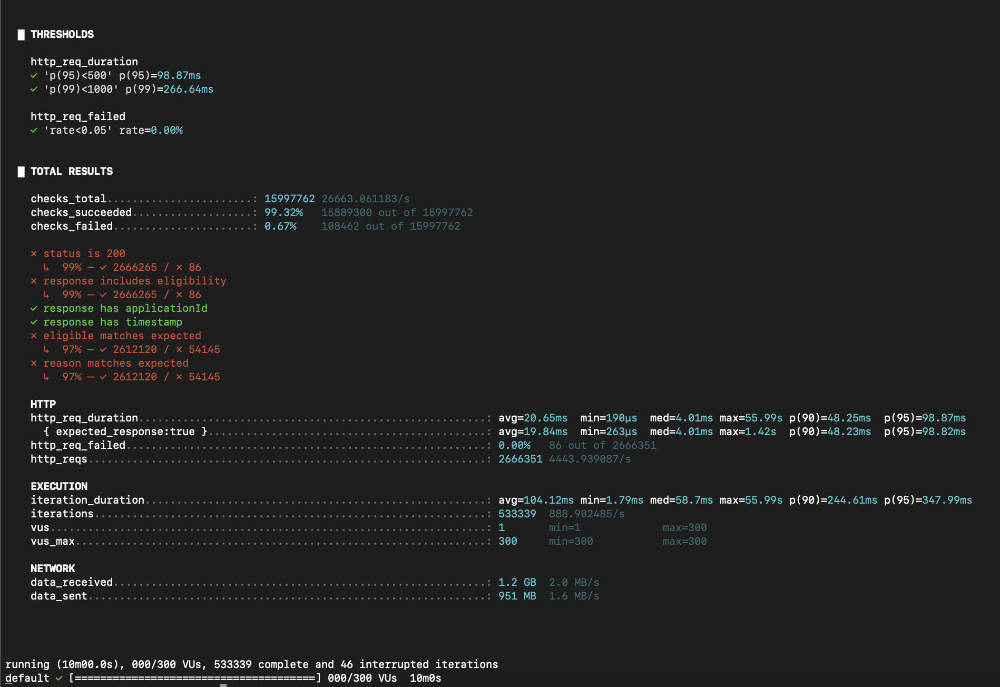
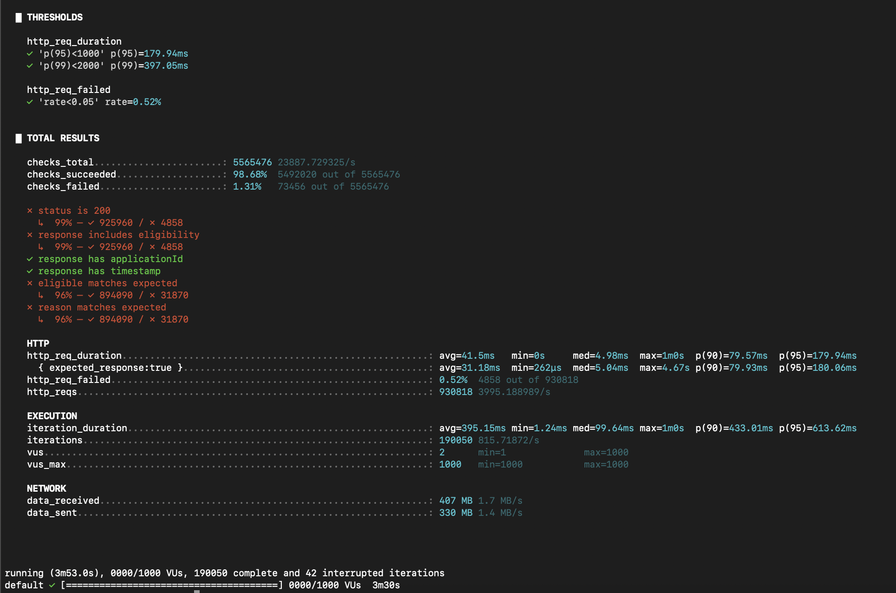
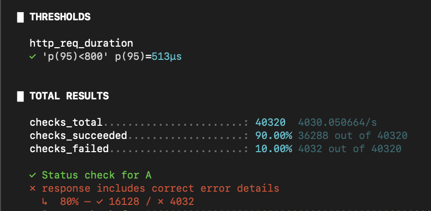
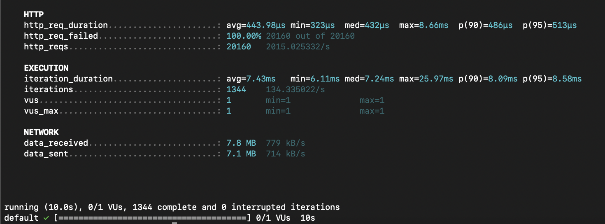
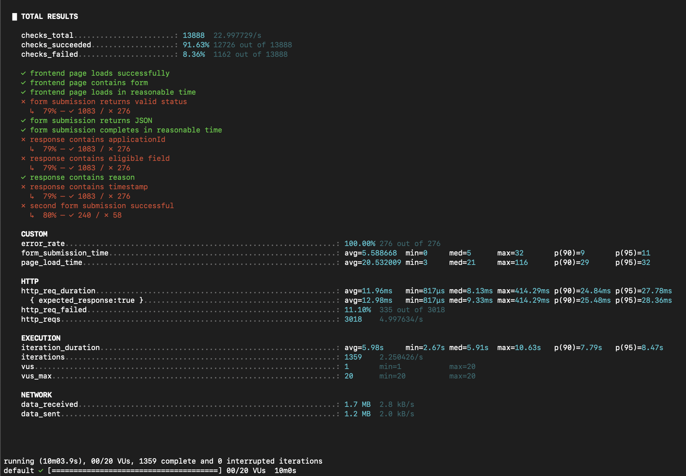

# Development Notes

this all text generate with AI ...OMG

#### Key Lessons Learned
- **Development with AI**: Using AI can help reduce time, decrease the chances of errors, and assist in verifying correctness, such as code review and automatic code refactoring.
- **Deploy Practices**: Learned how to use the Colima tool to simulate a small-scale production environment on a local machine and configuring Kubernetes for deployment customization.
- **Testing Practices**: Used K6 for performance testing to simulate real-world usage scenarios.

#### Strengths of Implementation
- Efficiency and Time-Saving: AI helped save development time, especially in writing and debugging code.
- Comprehensive Testing: Using tools like Playwright and K6 allowed for thorough testing of both UI functionality and system performance.
- Scalability and Flexibility: Kubernetes made the system more scalable and efficient in handling high loads.

#### Areas for Future Improvement
- Automating Deployment Pipelines: Enhance CI/CD pipeline workflows to further improve deployment efficiency and reduce delivery time.
- Monitoring and Logging: Implement a more comprehensive monitoring and logging system to make it easier to track issues during deployment or real-time usage.
- Improved Error Handling: Improve error management systems to resolve issues more quickly without impacting live usage.

#### Impact and Growth
- Increased Development Speed: Leveraging AI and automation tools significantly speed up development.
- Enhanced Deployment Flexibility: Kubernetes configuration allowed the system to adapt and scale smoothly in different environments.
- Better Testing Coverage: The combination of Playwright and K6 ensured comprehensive testing across both functionality and performance aspects of the project.

## K6 Test Result Images

*Result from: k6/01-api-apply-loans.smoke.test.js (API smoke test)*

*Result from: k6/02-api-apply-loans.average.test.js (API average load test)*

*Result from: k6/03-api-apply-loans.stress.test.js (API stress test)*

*Result from: k6/04-api-apply-loans.spike.test.js (API spike/peak test)*

*Result from: k6/05-api-apply-loans.validation.test.js (API validation test, part 1)*

*Result from: k6/05-api-apply-loans.validation.test.js (API validation test, part 2)*

*Result from: k6/06-frontend-web.average.test.js (Frontend average load test)*
